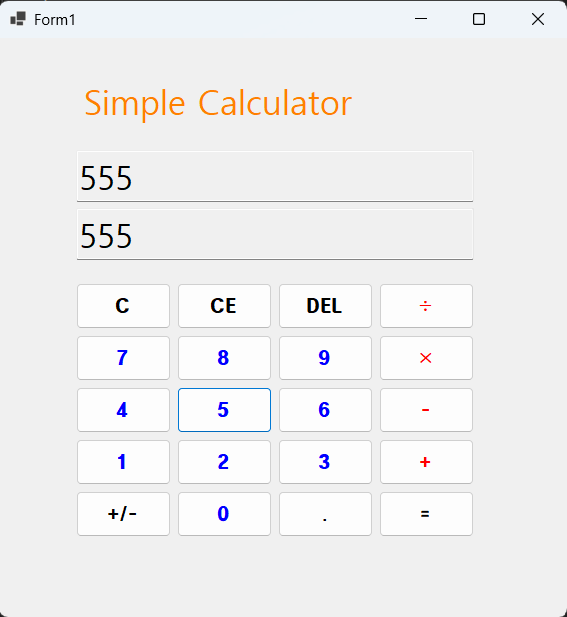
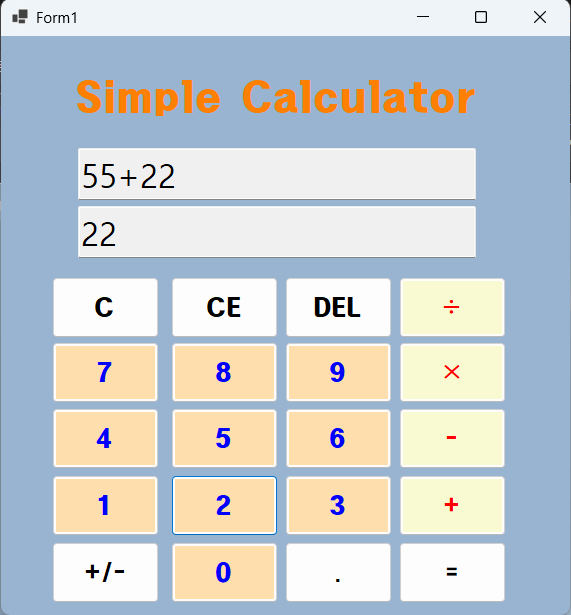
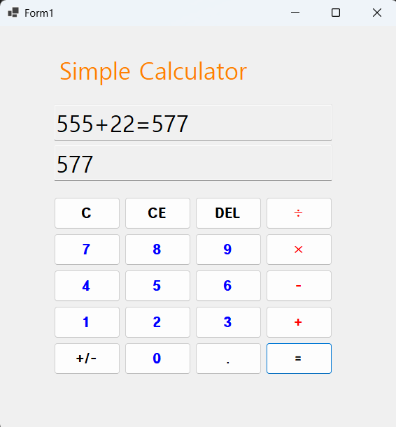
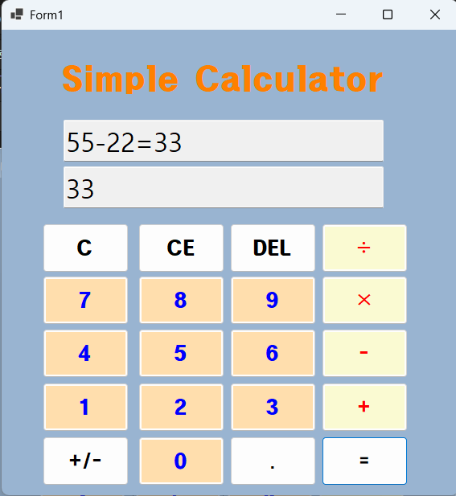
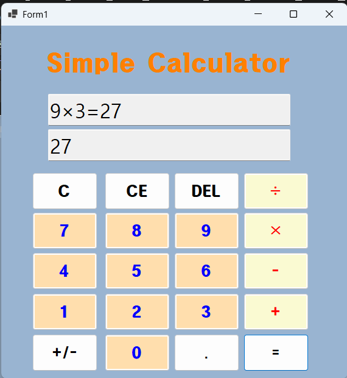
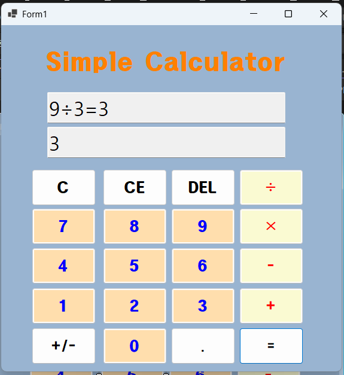
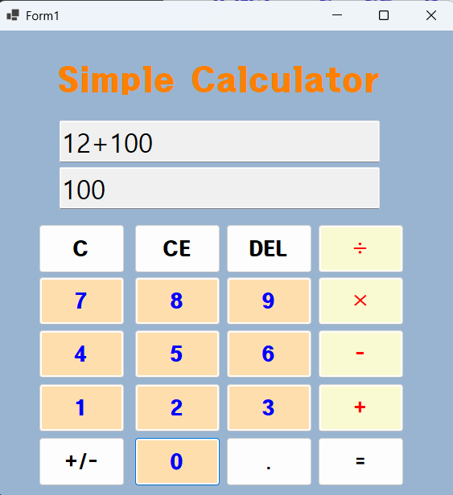
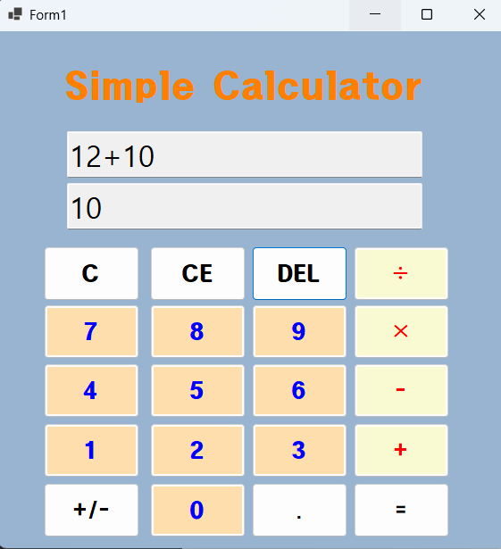
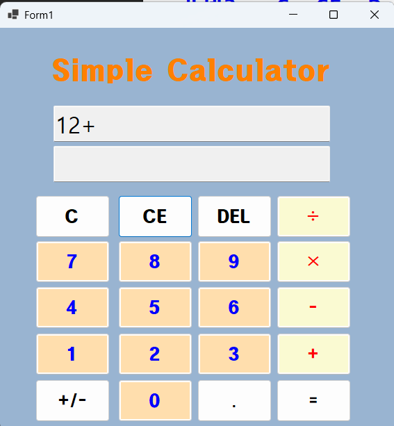
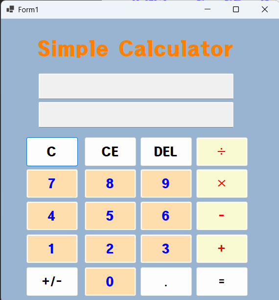

# (C# 코딩) 심플 사칙연산기
## 개요
- C# 프로그래밍 학습
- 1줄 소개: 사용자 키보드 입력을 받아서 처리하는 프로그램
- 사용한 플랫폼:
- C#, .NET Windows Forms, Visual Studio, GitHub
- 사용한 컨트롤:
- Label, TextBox, Button
- 사용한 기술과 구현한 기능:
- Visual Studio를 이용하여 UI 디자인
- 버튼을 이용해 텍스트 박스에 숫자 및 기호 입력

## 실행 화면 (과제1)
- 과제1 코드의 실행 스크린샷

- 과제 내용
1. UI 구성
▶ TextBox(입력표시, 결과표시), Button(계산) 등을 적절히 배치합니다. 
2. 숫자 입력 기능
▶ 숫자 Button 클릭 시 TextBox에 표시합니다.
3. 사칙연산 계산 기능
▶ 2개의 피연산자의 입력값을 Int로 바꾸어 더하기 계산을 수행하고 그 결과를 저장합니다. 
4. 계산 결과 출력
▶ 계산 결과 값을 문자열로 변환하여 표시합니다. 

- 구현 내용과 기능 설명
1. UI 구성을 도구상자에서 Label, TextBox, Button을 드래그하여 배치하였습니다.
2. 숫자 Button 클릭 시 TextBox에 표시하는 기능은 Button의 Click 이벤트 핸들러에서 TextBox의 Text 속성에 숫자를 추가하는 방식으로 구현하였습니다.
3. 사칙연산 계산 기능은 Button의 Click 이벤트 핸들러에서 TextBox에 입력된 값을 Int로 변환하여 계산을 수행하였습니다. 예를 들어, 더하기 계산의 경우 두 피연산자의 값을 Int로 변환한 후 더하기 연산을 수행하여 결과를 저장하였습니다.
4. 계산 결과 출력은 계산이 완료된 후 결과 값을 문자열로 변환하여 TextBox에 표시하는 방식으로 구현하였습니다. 예를 들어, 계산 결과를 ToString() 메서드를 사용하여 문자열로 변환한 후 TextBox의 Text 속성에 할당하여 출력하였습니다.

## 실행 화면 (과제2)
- 과제2 코드의 실행 스크린샷

- 과제 내용
1. 뺄셈(-), 곱셈(*), 나눗셈(/) 버튼 추가
▶ 키보드도 입력이 되게합니다.
2. 이벤트 연결
▶ 다른 연산자로 변경할수 있게 합니다. 

- 구현 내용과 기능 설명
1. 뺄셈(-), 곱셈(*), 나눗셈(/) 버튼에 각각 연산에 맞는 기능을 구현하였습니다.
2. 연산자 입력후 다른 연산자 버튼을 클릭하면 이전 연산이 수행되고 결과가 표시되도록 구현하였습니다. 

## 실행 화면 (과제3)
- 과제3 코드의 실행 스크린샷
 

DEL 눌렀을 경우

CE 눌렀을 경우

 

C 눌렀을 경우

- 과제 내용
1. 다음의 사례로 설명
▶ 12 + 100 = 112
2. C 버튼
▶ 현재의 모든 내용을 삭제하고 처음 (초기화된) 상태로 되돌아감
3. CE 버튼
▶ 마지막 입력한 피연산자(Operand) 값을 삭제함
▶ 100 입력 후에 Del 눌렀다면 100 값이 통째로 삭제됨
4. Del 버튼
▶ 마지막 입력된 글자 하나 (숫자 하나) 값을 삭제함
▶ 100 입력 후에 Del 눌렀다면 10 으로 변경됨

- 구현 내용과 기능 설명
1. C 버튼은 Button의 Click 이벤트 핸들러에서 TextBox의 Text 속성을 빈 문자열로 설정하여 초기화하는 방식으로 구현하였습니다.
2. CE 버튼은 Button의 Click 이벤트 핸들러에서 TextBox의 Text 속성에서 마지막 피연산자 값을 삭제하는 방식으로 구현하였습니다. 예를 들어, TextBox의 Text 속성에서 마지막 공백을 찾아 그 위치까지의 문자열을 유지하고 나머지를 삭제하는 방식으로 구현하였습니다.
3. Del 버튼은 Button의 Click 이벤트 핸들러에서 TextBox의 Text 속성에서 마지막 글자 하나를 삭제하는 방식으로 구현하였습니다. 예를 들어, TextBox의 Text 속성에서 마지막 글자를 제거하는 방식으로 구현하였습니다.

